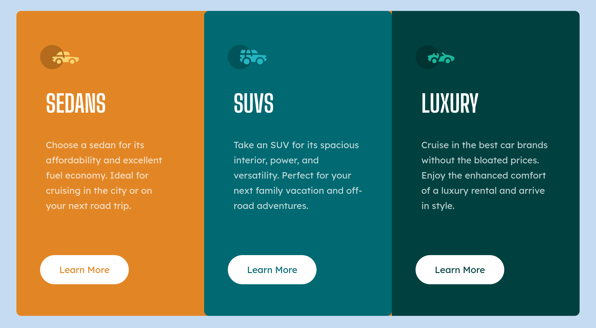

# Frontend Mentor - 3-column-preview

This is a solution to the [Stats preview card component challenge on Frontend Mentor](https://www.frontendmentor.io/challenges/stats-preview-card-component-8JqbgoU62). Frontend Mentor challenges help you improve your coding skills by building realistic projects. 

## Table of contents

- [Frontend Mentor - 3-column-preview](#frontend-mentor---3-column-preview)
  - [Table of contents](#table-of-contents)
  - [Overview](#overview)
    - [The challenge](#the-challenge)
    - [Screenshot](#screenshot)
  - [My process](#my-process)
    - [Built with](#built-with)
    - [What I learned](#what-i-learned)
    - [Continued development](#continued-development)
    - [Useful resources](#useful-resources)
  - [Author](#author)
  - [Acknowledgments](#acknowledgments)

## Overview

### The challenge

Users should be able to:

- View the optimal layout depending on their device's screen size

### Screenshot

## My process

Designed with mobile first intent, and since each card was the same size with inner content layed out the same, I was able to write the css for one and reuse it for the others. Allowing me to reduce a lot of unnecessary repetition in my code.

I did slightly modify `.sedan` so that the design would render on the page according to the design specs. I am not sure if the approach I took is correct (added `padding` instead of changing its `width`), but it saved me from writing extra css. Otherwise, from what I understand, if I were to change the actual `width`, it would have been necessary for me to create extra css to get `.sedan` layout correctly. With possibility of running into issues with matching the other cards' content layout.

### Built with

- HTML5
- CSS3
- Flexbox
- @media

### What I learned

- `padding` can be useful when wanting to enlarge a parent container that has a child element whose content is relative to the parent.
- use `min-width` not `min-device-width`

### Continued development

- Work on better naming conventions
- Be more systematic, still a lot of trial and error in approach, which is costing time
- Continue working with mobile first intent
- Reduce repetitive code

### Useful resources

[Figma](https://www.figma.com), [Mozilla](https://developer.mozilla.org/en-US/docs/Web/CSS), [Stack Overflow](https://stackoverflow.com/)

## Author

## Acknowledgments
